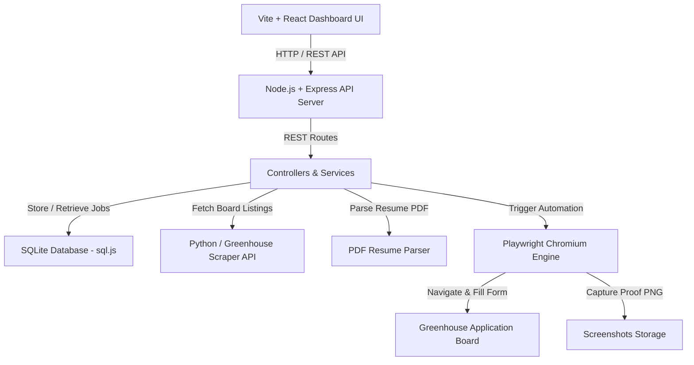

<div align="center">

# 🤖 JobBot — Greenhouse Automated Job Application Dashboard

**An end-to-end autonomous job application engine built with React, Node.js, Express, SQLite, Python, and Playwright.**

[](https://nodejs.org/)
[](https://react.dev/)
[](https://playwright.dev/)
[-skyblue.svg)](https://sql.js.org/)
[](https://www.docker.com/)

*Scrapes public Greenhouse job boards, parses PDF resumes automatically, auto-fills application forms with 100% field coverage, enforces strict non-submission safety guards, captures proof screenshots, and features a live dark-glassmorphism dashboard.*

---

</div>

## 🌟 Key Assessment Features & Technical Invariants

- 🛡️ **Mandatory Safety Non-Submission Invariant**:
  - The automation fills forms completely, reaches final review screens, captures screenshot proof (`screenshots/{job_id}.png`), and **STOPS**. It never clicks or triggers the final submission button unless explicitly toggled by user configuration.
- 🕷️ **Greenhouse Scraper Engine**:
  - Fetches 10–15 jobs from public Greenhouse company boards (`boards-api.greenhouse.io`), normalizes job metadata, decodes HTML entities, and prevents duplicate records upon re-scraping.
- 📄 **Structured Candidate Profile & Resume Uploader**:
  - Parses uploaded PDF resumes (`pdf-parse`) into structured profile fields (`data/candidate.json`), validating resume existence, file type, and attachment.
- ⚖️ **Form Filler & Validation Engine**:
  - Locates inputs via `aria-label`, `<label>`, `name`, `id`, `placeholder`, and matches candidate profile data.
  - Automatically matches EEO/demographic dropdown options (Gender, Race/Ethnicity, Disability Status, Veteran Status, Work Authorization).
  - Performs strict validation (`validateFilledForm`): if mandatory required fields are missing or unpopulated, sets status to `FAILED` with explicit `failure_reason` instead of false success messages.
- 🤖 **Security Challenge & CAPTCHA Handler**:
  - Automatically detects CAPTCHA / bot protection frames (`recaptcha`, `hcaptcha`, Cloudflare) and transitions job status to `MANUAL_INTERVENTION_REQUIRED` / `FAILED`.
- 📊 **Batch Apply-All & State Queue**:
  - Processes jobs sequentially, ensuring that an individual job failure or CAPTCHA challenge does NOT interrupt remaining queued jobs.
- 🧪 **Automated Testing Suite**:
  - Includes unit and integration tests (`npm test`) covering field mapping, safety non-submission guards, scraper normalization, and SQLite database state transitions.
- 🐳 **Containerized Docker Support**:
  - Ships with `Dockerfile` and `docker-compose.yml` for multi-stage browser container deployment.

---

## 🏛️ System Architecture



---

## 🚀 Quick Start

### Prerequisites
- **Node.js**: 18.0.0 or higher
- **npm**: 8.0.0 or higher
- **Python**: 3.9+ (optional, for standalone scraper execution)

### 1. Clone & Setup Repository

```bash
git clone https://github.com/TOUSIF-prog060/job_scrappingand_applying_automation.git
cd job_scrappingand_applying_automation
```

### 2. Install Workspace Dependencies

```bash
npm run install:all
npx playwright install chromium
```

### 3. Environment Configuration

Copy `.env.example` to `.env`:

```env
PORT=3001
GREENHOUSE_BOARD_TOKEN=figma
MAX_JOBS=15
HEADLESS=false
MAX_CONCURRENCY=1
```

---

## 💻 Running the Application

### Development Mode (Recommended)

Run both Express API server and React Vite UI:

```bash
npm run dev
```
Open **`http://localhost:5173`** in your browser.

---

### Production Mode

Build static assets and run unified production server:

```bash
npm run build
npm run start:prod
```
Open **`http://localhost:3001`** in your browser.

---

## 🧪 Running Automated Tests

Run the automated unit and integration test suite:

```bash
npm test
```

Test suite includes:
1. `tests/fieldMapper.test.js` — Field mapping & profile extraction logic.
2. `tests/safetyGuard.test.js` — Non-submission safety button blocking invariants.
3. `tests/database.test.js` — SQLite database CRUD operations and state transitions.

---

## 🐳 Running with Docker

You can launch the complete environment (Node API, static frontend, Playwright browser dependencies, SQLite DB) using Docker:

```bash
docker-compose up --build
```
Open **`http://localhost:3001`** in your browser.

---

## 📡 API Endpoints

| Method | Endpoint | Description |
|---|---|---|
| `GET` | `/api/jobs` | Retrieve all scraped jobs & status counters |
| `GET` | `/api/jobs/:id` | Get single job details |
| `POST` | `/api/jobs/scrape` | Trigger Greenhouse multi-board scraper |
| `POST` | `/api/applications/:id/apply` | Apply to single job (`{ allowSubmit: false }`) |
| `POST` | `/api/applications/apply-all` | Batch apply to all pending jobs |
| `GET` | `/api/applications/progress` | Fetch batch apply-all progress state |
| `GET` | `/api/applications/:id/screenshot` | View proof PNG screenshot |
| `GET` | `/api/candidate` | Retrieve candidate profile |
| `POST` | `/api/candidate/resume` | Upload PDF resume & parse structured data |

---

## 📜 Acceptance Criteria Checklist

- [x] **10–15 Jobs Collected**: Successfully scraped from public Greenhouse boards.
- [x] **Dashboard UI**: Displays jobs, match scores, status badges, and proof screenshots.
- [x] **Individual & Batch Apply**: Supports single-job apply and Apply-to-All queue.
- [x] **Resume Upload**: Automatically attaches dummy PDF resume to form uploads.
- [x] **Safety Non-Submission Guard**: Stops before final submit and captures PNG proof.
- [x] **CAPTCHA Safety**: Halts automation and flags `MANUAL_INTERVENTION_REQUIRED` if CAPTCHA detected.
- [x] **Form Validation**: Validates mandatory fields and returns explicit failure reasons when unpopulated.
- [x] **Automated Tests**: Unit & integration test suite included (`npm test`).
- [x] **Docker Support**: Dockerfile & docker-compose.yml included.
