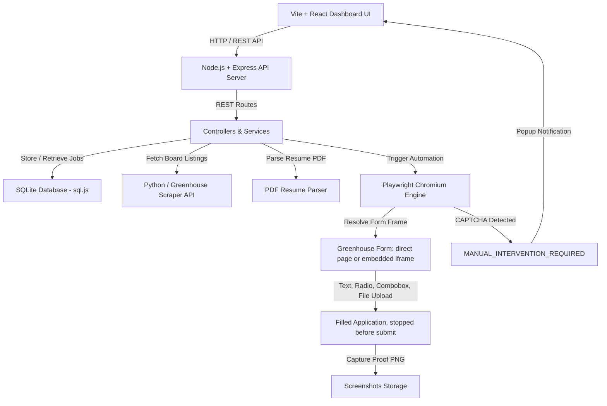

<div align="center">

# 🤖 JobBot — Greenhouse Automated Job Application Dashboard

**An end-to-end autonomous job application engine built with React, Node.js, Express, SQLite, Python, and Playwright.**

[](https://nodejs.org/)
[](https://react.dev/)
[](https://playwright.dev/)
[-skyblue.svg)](https://sql.js.org/)
[](https://www.docker.com/)

*Scrapes public Greenhouse job boards, parses PDF resumes automatically, auto-fills application forms across text inputs, radio groups, React dropdowns and embedded iframes, enforces strict non-submission safety guards, captures proof screenshots, and features a live dark-glassmorphism dashboard.*

---

</div>

## 🌟 Key Assessment Features & Technical Invariants

- 🛡️ **Mandatory Safety Non-Submission Invariant**:
  - The automation fills forms completely, reaches final review screens, captures screenshot proof (`screenshots/{job_id}.png`), and **STOPS**. It never clicks or triggers the final submission button unless explicitly toggled by user configuration.
- 🕷️ **Greenhouse Scraper Engine**:
  - Fetches 10–15 jobs from public Greenhouse company boards (`boards-api.greenhouse.io`), normalizes job metadata, decodes HTML entities, and prevents duplicate records upon re-scraping.
- 📄 **Structured Candidate Profile & Resume Uploader**:
  - Parses uploaded PDF resumes (`pdf-parse`) into structured profile fields (`data/candidate.json`), validating resume existence, file type, and attachment.
  - **Manual answers for details a resume never contains** — Expected Salary, Available Start Date, Years of Experience, Referral Source, Education and Website are editable from the dashboard (*Edit Profile & EEO*) and auto-filled into matching form fields.
- ⚖️ **Form Filler & Validation Engine**:
  - Locates inputs via `aria-label`, `aria-labelledby`, `<label>`, `name`, `id`, and `placeholder`, then matches candidate profile data.
  - Handles every control type a Greenhouse application uses: text inputs, textareas, native `<select>`, **radio groups** (matched from `<fieldset><legend>` question text), and **React `role="combobox"` dropdowns** that ignore programmatic `fill()`.
  - **Resolves embedded forms.** Companies such as Databricks and Stripe host the Greenhouse form in an iframe on their own careers site; the filler locates the frame holding real application fields and waits for it to load.
  - Follows an **"Apply now" entry button** on landing pages that have no form yet — only while nothing has been filled, so it can never fire on a completed form where *Apply* means submit.
  - Matches EEO/demographic answers (Gender, Race/Ethnicity, Disability Status, Veteran Status, Work Authorization, Sponsorship), including synonym mapping so a stored `Male` matches an option labelled `Man`.
  - Performs strict validation (`validateFilledForm`): if mandatory required fields are missing or **no fields were filled at all**, sets status to `FAILED` with an explicit `failure_reason` instead of a false success.
- 🤖 **Security Challenge & CAPTCHA Handler**:
  - Automatically detects CAPTCHA / bot protection frames (`recaptcha`, `hcaptcha`, Cloudflare), sets job status to `MANUAL_INTERVENTION_REQUIRED`, and raises a **dashboard popup** naming the blocked role with a direct link to finish it by hand.
- 📊 **Batch Apply-All & State Queue**:
  - Processes jobs sequentially, ensuring that an individual job failure or CAPTCHA challenge does NOT interrupt remaining queued jobs.
- 🧪 **Automated Testing Suite**:
  - Includes unit and integration tests (`npm test`) covering field mapping, safety non-submission guards, scraper normalization, and SQLite database state transitions.
- 🐳 **Containerized Docker Support**:
  - Ships with `Dockerfile` and `docker-compose.yml` for multi-stage browser container deployment.

---

## 🏛️ System Architecture



---

## 🚀 Quick Start

### Prerequisites
- **Node.js**: 18.0.0 or higher
- **npm**: 8.0.0 or higher
- **Python**: 3.9+ (optional, for standalone scraper execution)

### 1. Clone & Setup Repository

```bash
git clone https://github.com/TOUSIF-prog060/job_scrappingand_applying_automation.git
cd job_scrappingand_applying_automation
```

### 2. Install Workspace Dependencies

```bash
npm run install:all
npx playwright install chromium
```

### 3. Environment Configuration

Copy `.env.example` to `.env`:

```env
PORT=3001
GREENHOUSE_BOARD_TOKEN=figma
MAX_JOBS=15
HEADLESS=false
MAX_CONCURRENCY=1
```

---

## 💻 Running the Application

### Development Mode (Recommended)

Run both Express API server and React Vite UI:

```bash
npm run dev
```
Open **`http://localhost:5173`** in your browser.

---

### Production Mode

Build static assets and run unified production server:

```bash
npm run build
npm run start:prod
```
Open **`http://localhost:3001`** in your browser.

---

## 🧪 Running Automated Tests

Run the automated unit and integration test suite:

```bash
npm test
```

Test suite includes:
1. `tests/fieldMapper.test.js` — Field mapping & profile extraction logic.
2. `tests/safetyGuard.test.js` — Non-submission safety button blocking invariants.
3. `tests/database.test.js` — SQLite database CRUD operations and state transitions.

---

## 🐳 Running with Docker

You can launch the complete environment (Node API, static frontend, Playwright browser dependencies, SQLite DB) using Docker:

```bash
docker-compose up --build
```
Open **`http://localhost:3001`** in your browser.

---

## 📡 API Endpoints

| Method | Endpoint | Description |
|---|---|---|
| `GET` | `/api/jobs` | Retrieve all scraped jobs & status counters |
| `GET` | `/api/jobs/:id` | Get single job details |
| `POST` | `/api/jobs/scrape` | Trigger Greenhouse multi-board scraper |
| `POST` | `/api/applications/:id/apply` | Apply to single job (`{ allowSubmit: false }`) |
| `POST` | `/api/applications/apply-all` | Batch apply to all pending jobs |
| `POST` | `/api/applications/stop-all` | Cancel a running batch apply-all |
| `GET` | `/api/applications/progress` | Fetch batch apply-all progress state |
| `GET` | `/api/applications/:id/status` | Poll a single job's status |
| `GET` | `/api/applications/:id/screenshot` | View proof PNG screenshot |
| `GET` | `/api/candidate` | Retrieve candidate profile |
| `PUT` | `/api/candidate` | Update profile fields, EEO answers & manual details |
| `POST` | `/api/candidate/resume` | Upload PDF resume & parse structured data |
| `POST` | `/api/candidate/cover-letter` | Upload a cover letter document |

---

## 🚦 Job Status Reference

| Status | Meaning |
|---|---|
| `NOT_STARTED` | Scraped and queued, no attempt yet |
| `PROCESSING` | Browser open, navigating to the application |
| `FORM_FILLED` | Fields populated, still working through the flow |
| `READY_FOR_SUBMISSION` | Reached the review/submit screen and stopped |
| `SCREENSHOT_CAPTURED` | Completed — proof PNG saved |
| `MANUAL_INTERVENTION_REQUIRED` | CAPTCHA / bot protection hit; raises a dashboard popup and needs a human |
| `FAILED` | Automation could not fill the form; see `failure_reason` |

`failure_reason` is cleared automatically when a retry succeeds, so a completed job never displays a stale error.

---

## ⚠️ Field Coverage & Limitations

The filler populates every field it can map to your profile. Questions with **no profile equivalent** are deliberately left blank rather than guessed — for example state-residency eligibility, commuting distance, sponsorship-country checklists, consent/acknowledgement checkboxes, and demographic questions the profile does not track (such as sexual orientation).

Because the automation always stops before submission, these remain for you to complete during review. Anything skipped is reported in the `skipped` list logged by `fillVisibleFields`.

---

## 📜 Acceptance Criteria Checklist

- [x] **10–15 Jobs Collected**: Successfully scraped from public Greenhouse boards.
- [x] **Dashboard UI**: Displays jobs, match scores, status badges, and proof screenshots.
- [x] **Individual & Batch Apply**: Supports single-job apply and Apply-to-All queue.
- [x] **Resume Upload**: Automatically attaches dummy PDF resume to form uploads.
- [x] **Safety Non-Submission Guard**: Stops before final submit and captures PNG proof.
- [x] **CAPTCHA Safety**: Halts automation, flags `MANUAL_INTERVENTION_REQUIRED`, and raises a dashboard popup when a CAPTCHA is detected.
- [x] **Form Validation**: Validates mandatory fields and returns explicit failure reasons when unpopulated — a run that fills nothing reports `FAILED` rather than a misleading success.
- [x] **Embedded Form Support**: Fills Greenhouse forms hosted inside an iframe on a company's own careers site.
- [x] **Automated Tests**: Unit & integration test suite included (`npm test`).
- [x] **Docker Support**: Dockerfile & docker-compose.yml included.
