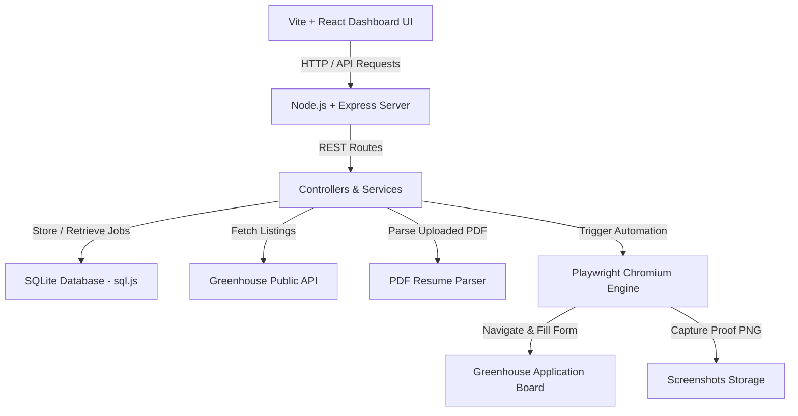

<div align="center">

# 🤖 JobBot — Automated Job Application Dashboard

**An end-to-end autonomous job application engine built with React, Node.js, Express, SQLite, and Playwright.**

[](https://nodejs.org/)
[](https://react.dev/)
[](https://playwright.dev/)
[-skyblue.svg)](https://sql.js.org/)
[](LICENSE)

*Scrapes job listings from Greenhouse, parses PDF resumes automatically, auto-fills application forms with 100% question coverage (including EEO/demographics), captures proof screenshots, and features a live dark-glassmorphism dashboard.*

---

</div>

## 🌟 Key Features

- 🕷️ **Greenhouse Scraper Engine** — Fetches, normalizes, decodes HTML entities, and deduplicates listings from public Greenhouse board APIs (e.g., Figma, Stripe, Discord).
- 📄 **PDF Resume Auto-Parser** — Upload any PDF resume; `pdf-parse` automatically extracts Full Name, Email, Phone, Location, Social Links (LinkedIn/GitHub), Current Title, Education, and Skills.
- ⚖️ **100% Form & EEO Question Coverage** — Auto-fills standard fields and complex EEO/demographic dropdowns (Gender, Race/Ethnicity, Disability Status, Veteran Status, Work Authorization, Sponsorship, Salary).
- ✏️ **Interactive Profile & EEO Editor** — Edit candidate details, demographic choices, and custom Q&A fallback answers directly from a clean UI modal.
- 🎛️ **Dual Application Modes**:
  - 🛡️ **Proof Only Mode (Default Safety Guard)**: Fills 100% of fields, stops right before submission, and captures a full-page PNG screenshot of the filled form as proof.
  - ⚡ **Real Submission Mode**: Auto-fills the form, clicks *Submit Application*, waits for the confirmation page ("Thank You / Application Received"), and captures post-submission proof.
- 🖥️ **Live Glassmorphism Dashboard** — Real-time polling (3s loop), search filtering, statistics counters, apply-all batch progress bar, and full-resolution screenshot viewer modal.
- 📦 **Single-Command Production Deployment** — Unified Express server serves built static React frontend assets (`frontend/dist`) and API endpoints on port 3001.

---

## 🏛️ System Architecture



### Layer Breakdown

| Layer | Technologies | Description |
|---|---|---|
| **Frontend** | React 18, Vite 5, Vanilla CSS | Glassmorphism dashboard with polling, toast notifications, search, profile editor, and screenshot viewer. |
| **Backend API** | Node.js, Express 4, Multer | RESTful API endpoints for jobs, candidate management, resume parsing, and async application triggers. |
| **Database** | SQLite via `sql.js` | Zero-compilation pure-JS SQLite database for storing job state machine records. |
| **Automation** | Playwright (Chromium) | Form-filling engine with direct Greenhouse ID selectors, EEO dropdown matchers, and safety guards. |
| **Scraper** | Native `fetch` (Node 18+) | Normalizes Greenhouse API output, decodes HTML entities, and deduplicates entries. |

---

## 🚀 Quick Start

### Prerequisites
- **Node.js**: 18.0.0 or higher
- **npm**: 8.0.0 or higher

### 1. Clone the Repository

```bash
git clone https://github.com/TOUSIF-prog060/job_scrappingand_applying_automation.git
cd job_scrappingand_applying_automation
```

### 2. Install Dependencies

```bash
# Install backend dependencies
cd backend && npm install

# Install frontend dependencies
cd ../frontend && npm install

# Install Playwright Chromium browser
cd ../backend && npx playwright install chromium
```

### 3. Environment Configuration

Create a `.env` file in the root directory (or use the provided `.env.example`):

```env
PORT=3001
GREENHOUSE_BOARD_TOKEN=figma   # Options: figma, stripe, discord
MAX_JOBS=15
HEADLESS=false                  # false = visible browser window for debugging
```

---

## 💻 Running the Application

### Production Mode (Unified Single Port)

Build the frontend bundle and start the Express production server:

```bash
# From root directory:
npm run build
npm run start:prod
```
Open **`http://localhost:3001`** in your browser. Both the React UI and REST API run on port `3001`.

---

### Development Mode (Hot Reloading)

Run backend and frontend servers in separate terminals:

```bash
# Terminal 1 — Backend API (:3001)
cd backend
npm run dev

# Terminal 2 — Frontend Dev Server (:5173)
cd frontend
npm run dev
```
Open **`http://localhost:5173`** in your browser.

---

## 📖 How to Use

1. **Scrape Jobs**:
   - Click **`🕷️ Scrape Jobs`** in the dashboard header or send a `POST /api/jobs/scrape` request to populate listings.
2. **Upload & Parse Resume**:
   - Click **`📎 Upload Resume`** / **`📄 Replace Resume`** in the Candidate Panel to upload a PDF resume.
   - The parser automatically populates candidate details, contact info, social links, education, and skills.
3. **Edit Candidate & EEO Profile**:
   - Click **`✏️ Edit Profile & EEO`** to confirm or update Gender, Race/Ethnicity, Disability Status, Veteran Status, Work Authorization, Salary, and Custom Question Fallbacks.
4. **Choose Application Mode**:
   - **`🛡️ Proof Only (Safe)`**: Stops at review page, takes screenshot of filled form.
   - **`⚡ Real Submission`**: Fills form, clicks *Submit Application*, takes post-submission confirmation screenshot.
5. **Apply**:
   - Click **`⚡ Apply`** on any card or **`⚡ Apply to All`** to launch automation.
   - Click **`📸 Screenshot`** on completed cards to inspect the proof image.

---

## 📡 API Reference

### Jobs API

| Method | Endpoint | Description |
|---|---|---|
| `GET` | `/api/jobs` | Get all scraped jobs and stats summary |
| `GET` | `/api/jobs/:id` | Get single job details |
| `POST` | `/api/jobs/scrape` | Trigger Greenhouse scraper |

### Applications API

| Method | Endpoint | Description |
|---|---|---|
| `POST` | `/api/applications/:jobId/apply` | Apply to job (`{ allowSubmit: boolean }`) |
| `POST` | `/api/applications/apply-all` | Apply to all pending jobs (`{ allowSubmit: boolean }`) |
| `GET` | `/api/applications/progress` | Get batch apply-all progress |
| `GET` | `/api/applications/:jobId/status` | Get job automation status |
| `GET` | `/api/applications/:jobId/screenshot` | View proof PNG screenshot |

### Candidate API

| Method | Endpoint | Description |
|---|---|---|
| `GET` | `/api/candidate` | Fetch current candidate profile |
| `PUT` | `/api/candidate` | Update candidate profile & EEO answers |
| `POST` | `/api/candidate/resume` | Upload PDF resume & trigger auto-parser |

---

## 🛠️ Project Structure

```
job_scrappingand_applying_automation/
├── backend/
│   ├── controllers/     # Express route controllers (jobs, applications, candidate)
│   ├── db/              # SQLite database initialization & SQL schema (sql.js)
│   ├── routes/          # Express route definitions
│   ├── scripts/         # Standalone CLI scripts (runScraper.js)
│   ├── services/        # Business logic (jobService, applicationService, resumeParser)
│   └── server.js        # Express server entry point (API + static asset serving)
├── scraper/
│   └── greenhouseScraper.js # Greenhouse API fetcher & HTML entity decoder
├── automation/
│   ├── applyToJob.js        # Per-job automation orchestrator
│   ├── browserManager.js    # Playwright browser instance manager
│   ├── fieldMapper.js       # Label & key fuzzy matcher
│   ├── formFiller.js        # Form filler, EEO dropdown matcher, submit handler
│   └── screenshotCapture.js # Full-page PNG screenshot capture utility
├── frontend/
│   ├── dist/                # Production build output
│   └── src/
│       ├── api/             # Frontend API client wrappers (jobsApi.js)
│       └── components/      # React components (Dashboard, CandidatePanel, CandidateEditModal, etc.)
├── data/
│   ├── candidate.json       # Candidate profile store
│   └── resume.pdf           # Uploaded PDF resume
├── screenshots/             # Proof screenshots directory
├── .env.example             # Environment template
├── package.json             # Workspace package config
└── README.md                # Project documentation
```

---

## 🛡️ Safety & Reliability

- **Code-Level Submit Guard**: `isSafeToClick()` in `automation/formFiller.js` explicitly blocks submit clicks unless *Real Submission Mode* is explicitly toggled by the user.
- **Active CAPTCHA Detection**: `detectCaptcha()` scans for active visible challenge elements (`iframe[src*="recaptcha"]`, `.g-recaptcha`, `.h-captcha`) to eliminate static script false positives.
- **Graceful Error Handling**: Captures error state screenshots if timeouts or page navigation issues occur.

---

## 📜 License

Distributed under the MIT License. See `LICENSE` for details.
